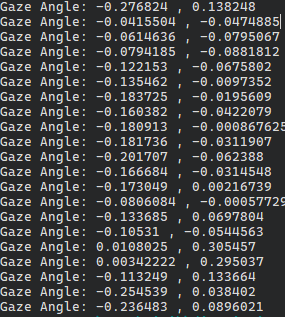
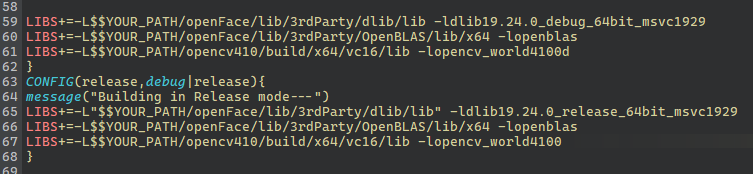
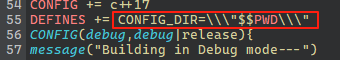

# 适用与Qt的OpenFace

探索利用OpenFace进行Qt桌面应用开发的方法。

该项目初步实现了基于OpenFace进行视线追踪的方法，只获取视线角度，没有进行画面显示，运行结果如下图



## 使用方法

### 准备工作

1. 建议安装[OpenFace_2.2.0](https://github.com/TadasBaltrusaitis/OpenFace/releases/tag/OpenFace_2.2.0)已获取所需要的库文件，
建议阅读OpenFace的[wiki](https://github.com/TadasBaltrusaitis/OpenFace/wiki)
2. git下载[OpenFace](https://github.com/TadasBaltrusaitis/OpenFace/tree/master)仓库
    ```bash
    git clone https://github.com/TadasBaltrusaitis/OpenFace.git
    ```

3. 将[OpenFace/lib](https://github.com/TadasBaltrusaitis/OpenFace/tree/master/lib)文件夹移动到本项目的[openFace](./openFace)文件夹中

4. 修改[QtOpenFace.pro](./QtOpenFace.pro)文件，配置dlib、OpenBLAS、OpenCV的库路径，注意：需要使用绝对位置

    

5. 修改[QtOpenFace.pro](./QtOpenFace.pro)文件中CONFIG_DIR参数，指向OpenFace的模型文件夹路径，模型文件夹下包括[OpenFace_2.2.0](https://github.com/TadasBaltrusaitis/OpenFace/releases/tag/OpenFace_2.2.0)安装目录下的classifiers、model、AU_predictors文件夹，在model/patch_experts文件夹下还需要下载[cen_patches_0.25](https://www.dropbox.com/s/7na5qsjzz8yfoer/cen_patches_0.25_of.dat?dl=1)、[cen_patches_0.35](https://www.dropbox.com/s/k7bj804cyiu474t/cen_patches_0.35_of.dat?dl=1)、[cen_patches_0.50](https://www.dropbox.com/s/ixt4vkbmxgab1iu/cen_patches_0.50_of.dat?dl=1)、[cen_patches_1.00](https://www.dropbox.com/s/2t5t1sdpshzfhpj/cen_patches_1.00_of.dat?dl=1)四个文件，具体可以参阅[OpenFace_2.2.0](https://github.com/TadasBaltrusaitis/OpenFace/releases/tag/OpenFace_2.2.0)安装目录下的download_models.ps1文件
   
   

6. 编译项目，我使用的编译环境为Desktop Qt 5.15.2 MsVc2019 64bit
7. 运行，运行前请将[OpenFace_2.2.0](https://github.com/TadasBaltrusaitis/OpenFace/releases/tag/OpenFace_2.2.0)安装目录下的库文件移动到可执行文件所在目录，缺什么就移动什么，否则会报错


# 版权

参考[OpenFace](https://github.com/TadasBaltrusaitis/OpenFace#copyright)